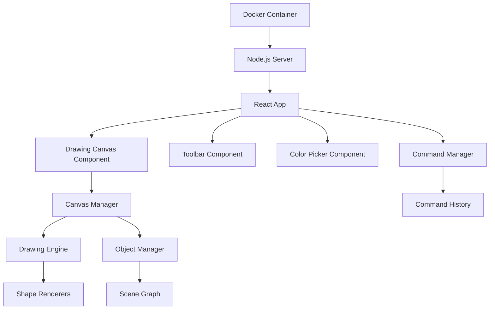

# Design Document

## Overview

The sketch drawing application will be built as a React-based web application using HTML5 Canvas for rendering. The application follows a component-based architecture with clear separation between the drawing engine, UI components, and state management. The system uses a command pattern for undo/redo functionality and maintains a scene graph of drawable objects.

## Architecture

### High-Level Architecture



### Technology Stack

- **Frontend**: React 18 with TypeScript
- **Canvas Rendering**: HTML5 Canvas API
- **State Management**: React Context + useReducer
- **Styling**: CSS Modules or Styled Components
- **Build Tool**: Vite
- **Container**: Docker with Node.js Alpine base image

## Components and Interfaces

### Core Components

#### 1. App Component
- Main application container
- Manages global state and context providers
- Coordinates between toolbar, canvas, and color picker

#### 2. DrawingCanvas Component
- Renders the HTML5 canvas element
- Handles mouse/touch events for drawing
- Manages canvas dimensions and scaling
- Interfaces with CanvasManager for rendering

#### 3. Toolbar Component
- Displays drawing mode buttons
- Manages active tool selection
- Provides undo/redo buttons
- Shows current mode status

#### 4. ColorPicker Component
- Displays color selection interface
- Manages current color state
- Provides preset colors and custom color picker

### Core Classes

#### 1. CanvasManager
```typescript
interface CanvasManager {
  canvas: HTMLCanvasElement;
  context: CanvasRenderingContext2D;
  render(): void;
  clear(): void;
  getMousePosition(event: MouseEvent): Point;
}
```

#### 2. DrawingEngine
```typescript
interface DrawingEngine {
  startDrawing(point: Point, mode: DrawingMode): void;
  continueDrawing(point: Point): void;
  finishDrawing(): DrawableObject | null;
  previewDrawing(point: Point): void;
}
```

#### 3. ObjectManager
```typescript
interface ObjectManager {
  objects: DrawableObject[];
  addObject(object: DrawableObject): void;
  removeObject(id: string): void;
  selectObject(point: Point): DrawableObject | null;
  moveObject(id: string, delta: Point): void;
  getObjectAt(point: Point): DrawableObject | null;
}
```

#### 4. CommandManager
```typescript
interface CommandManager {
  executeCommand(command: Command): void;
  undo(): void;
  redo(): void;
  canUndo(): boolean;
  canRedo(): boolean;
}
```

#### 5. GroupManager
```typescript
interface GroupManager {
  createGroup(objectIds: string[]): Group;
  ungroup(groupId: string): void;
  isGrouped(objectId: string): boolean;
  getGroup(objectId: string): Group | null;
  getAllGroups(): Group[];
}
```

#### 6. FileManager
```typescript
interface FileManager {
  saveSketch(filename: string, data: SketchData): Promise<void>;
  loadSketch(filename: string): Promise<SketchData>;
  listSavedSketches(): Promise<string[]>;
  deleteSketch(filename: string): Promise<void>;
}
```

## Data Models

### DrawableObject
```typescript
interface DrawableObject {
  id: string;
  type: ObjectType;
  points: Point[];
  color: string;
  isSelected: boolean;
  bounds: Rectangle;
  render(context: CanvasRenderingContext2D): void;
  containsPoint(point: Point): boolean;
  move(delta: Point): void;
  clone(): DrawableObject;
}
```

### Drawing Modes
```typescript
enum DrawingMode {
  FREEHAND = 'freehand',
  LINE = 'line',
  RECTANGLE = 'rectangle',
  SQUARE = 'square',
  ELLIPSE = 'ellipse',
  CIRCLE = 'circle',
  OPEN_POLYGON = 'open_polygon',
  CLOSED_POLYGON = 'closed_polygon',
  SELECT = 'select'
}
```

### Commands
```typescript
interface Command {
  execute(): void;
  undo(): void;
  redo(): void;
}

class AddObjectCommand implements Command {
  constructor(private objectManager: ObjectManager, private object: DrawableObject) {}
  // Implementation details
}

class DeleteObjectCommand implements Command {
  constructor(private objectManager: ObjectManager, private objectId: string) {}
  // Implementation details
}

class MoveObjectCommand implements Command {
  constructor(private objectManager: ObjectManager, private objectId: string, private delta: Point) {}
  // Implementation details
}
```

### Group
```typescript
interface Group {
  id: string;
  objectIds: string[];
  isSelected: boolean;
  bounds: Rectangle;
  move(delta: Point): void;
  clone(): Group;
  containsPoint(point: Point): boolean;
}
```

### SketchData
```typescript
interface SketchData {
  version: string;
  objects: DrawableObject[];
  groups: Group[];
  metadata: {
    createdAt: string;
    modifiedAt: string;
    name: string;
  };
}
```

### Additional Commands
```typescript
class GroupObjectsCommand implements Command {
  constructor(private groupManager: GroupManager, private objectIds: string[]) {}
  // Implementation details
}

class UngroupCommand implements Command {
  constructor(private groupManager: GroupManager, private groupId: string) {}
  // Implementation details
}
```

### Application State
```typescript
interface AppState {
  currentMode: DrawingMode;
  currentColor: string;
  selectedObjectIds: string[];
  selectedGroupIds: string[];
  isDrawing: boolean;
  objects: DrawableObject[];
  groups: Group[];
  canUndo: boolean;
  canRedo: boolean;
  currentSketchName: string | null;
}
```

## Error Handling

### Canvas Errors
- Handle canvas context creation failures
- Graceful degradation for unsupported browsers
- Error boundaries for React components

### Drawing Errors
- Validate drawing operations before execution
- Handle invalid coordinates or dimensions
- Prevent drawing outside canvas bounds

### Command Errors
- Validate commands before execution
- Handle undo/redo stack corruption
- Graceful recovery from invalid states

### User Input Errors
- Validate color values
- Handle invalid polygon creation
- Prevent selection of non-existent objects

## Testing Strategy

### Unit Tests
- Test individual shape rendering functions
- Test command pattern implementation
- Test object selection and manipulation logic
- Test undo/redo functionality

### Integration Tests
- Test drawing workflow end-to-end
- Test mode switching functionality
- Test object manipulation workflows
- Test color application

### Component Tests
- Test React component rendering
- Test event handling
- Test state management
- Test component interactions

### Docker Tests
- Test container build process
- Test application startup in container
- Test port mapping and accessibility
- Test container resource usage

### Performance Considerations
- Optimize canvas rendering for large numbers of objects
- Implement object culling for off-screen objects
- Use requestAnimationFrame for smooth drawing
- Minimize re-renders through proper React optimization

### Accessibility
- Provide keyboard shortcuts for common operations
- Add ARIA labels for screen readers
- Ensure sufficient color contrast
- Support keyboard navigation for tool selection

### Docker Configuration
- Multi-stage build for optimized image size
- Non-root user for security
- Health checks for container monitoring
- Environment variable configuration for ports and settings