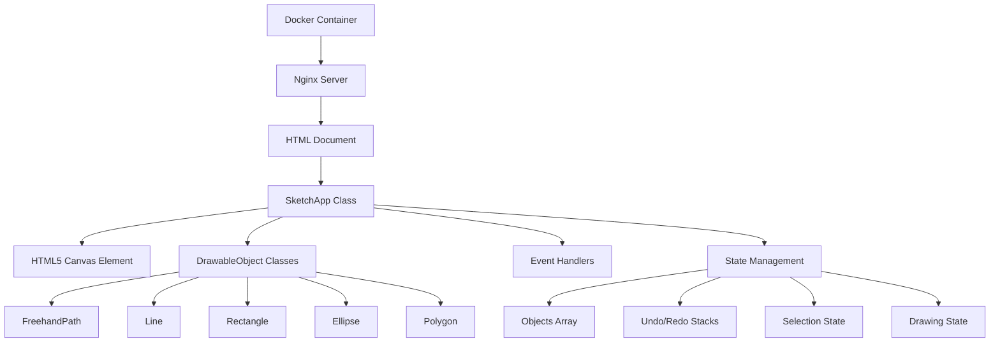

# Design Document

## Overview

The sketch drawing application is built as a vanilla JavaScript web application
using HTML5 Canvas for rendering. The application follows an object-oriented
architecture with a single main SketchApp class that manages all functionality
including drawing, object management, undo/redo, grouping, and file operations.
The system maintains a collection of drawable objects and provides real-time
drawing feedback with preview shapes.

## Architecture

### High-Level Architecture



### Technology Stack

- **Frontend**: Vanilla JavaScript (ES6+)
- **Canvas Rendering**: HTML5 Canvas API
- **Styling**: Pure CSS with flexbox layout
- **Architecture**: Single-class design with object-oriented drawable shapes
- **Container**: Docker with Nginx Alpine base image
- **Server**: Nginx for serving static files
- **Storage**: Browser localStorage for save/load functionality

## Components and Interfaces

### Core Classes

#### 1. SketchApp (Main Application Class)

- Single main class that manages all application functionality
- Handles canvas rendering and drawing operations
- Manages object collection and selection state
- Implements undo/redo functionality with state snapshots
- Handles all mouse/touch event interactions
- Manages drawing modes and color selection
- Implements grouping and file operations

#### 2. DrawableObject (Base Class)

- Base class for all drawable shapes
- Provides common functionality (bounds calculation, selection, movement)
- Defines interface for rendering and hit testing
- Manages object properties (color, selection state, ID)
- Implements cloning for copy operations

#### 3. Shape Classes (Concrete Implementations)

- **FreehandPath**: Handles freehand drawing with array of points
- **Line**: Manages straight line drawing between two points
- **Rectangle**: Handles rectangle drawing with square constraint option
- **Ellipse**: Manages ellipse drawing with circle constraint option
- **Polygon**: Handles polygon drawing with open/closed options and multi-click
  creation

### Core Functionality (All Integrated in SketchApp)

#### 1. Drawing Operations

```javascript
class SketchApp {
  startDrawing(e) {/* Handles mouse down events */}
  continueDrawing(e) {/* Handles mouse move events */}
  finishDrawing(e) {/* Handles mouse up events */}
  createPreviewShape() {/* Shows real-time drawing preview */}
  render() {/* Renders all objects and preview to canvas */}
}
```

#### 2. Object Management

```javascript
class SketchApp {
  addObject(object) {/* Adds completed objects to collection */}
  deleteSelected() {/* Removes selected objects */}
  selectObject(obj) {/* Handles object selection */}
  getObjectAt(pos) {/* Hit testing for object selection */}
  clearSelection() {/* Clears all selections */}
  moveSelected(delta) {/* Moves selected objects */}
}
```

#### 3. Undo/Redo System

```javascript
class SketchApp {
  saveState() {/* Saves current state to undo stack */}
  undo() {/* Restores previous state */}
  redo() {/* Restores next state */}
  updateUndoRedoButtons() {/* Updates UI button states */}
}
```

#### 4. Grouping Operations

```javascript
class SketchApp {
  groupSelected() {/* Groups selected objects */}
  ungroupSelected() {/* Ungroups selected group */}
  isGroup(obj) {/* Checks if object is a group */}
}
```

#### 5. File Operations (LocalStorage)

```javascript
class SketchApp {
  saveSketch() {/* Saves current drawing to localStorage */}
  loadSketch() {/* Loads drawing from localStorage */}
  exportSketch() {/* Exports drawing as JSON */}
  importSketch() {/* Imports drawing from JSON */}
}
```

## Data Models

### DrawableObject (Base Class)

```javascript
class DrawableObject {
  constructor(type, points, color) {
    this.id = Math.random().toString(36).substring(2, 11);
    this.type = type;
    this.points = [...points];
    this.color = color;
    this.isSelected = false;
    this.bounds = this.calculateBounds();
  }

  // Abstract methods implemented by subclasses
  render(context) {/* Override in subclass */}
  containsPoint(point) {/* Override in subclass */}
  clone() {/* Override in subclass */}

  // Common functionality
  move(delta) {/* ... */}
  calculateBounds() {/* ... */}
}
```

### Drawing Modes

```javascript
const DrawingMode = {
  FREEHAND: "freehand",
  LINE: "line",
  RECTANGLE: "rectangle",
  SQUARE: "square",
  ELLIPSE: "ellipse",
  CIRCLE: "circle",
  OPEN_POLYGON: "open_polygon",
  CLOSED_POLYGON: "closed_polygon",
  SELECT: "select",
};
```

### Object Types

```javascript
const ObjectType = {
  FREEHAND_PATH: "freehand_path",
  LINE: "line",
  RECTANGLE: "rectangle",
  ELLIPSE: "ellipse",
  POLYGON: "polygon",
};
```

### Application State (Managed in SketchApp)

```javascript
class SketchApp {
  constructor() {
    // Drawing state
    this.currentMode = DrawingMode.FREEHAND;
    this.currentColor = "#000000";
    this.isDrawing = false;
    this.currentShape = null;
    this.previewShape = null;

    // Object management
    this.objects = [];
    this.selectedObjects = [];

    // Undo/Redo
    this.undoStack = [];
    this.redoStack = [];

    // Polygon drawing state
    this.polygonPoints = [];
    this.isDrawingPolygon = false;

    // Canvas and UI references
    this.canvas = null;
    this.ctx = null;
  }
}
```

### Group Structure

```javascript
// Groups are represented as special objects with grouped object references
class Group extends DrawableObject {
  constructor(objects, color = "#000000") {
    super("group", [], color);
    this.groupedObjects = [...objects];
    this.bounds = this.calculateGroupBounds();
  }

  calculateGroupBounds() {
    // Calculate combined bounds of all grouped objects
  }

  render(ctx) {
    // Render all grouped objects
    this.groupedObjects.forEach((obj) => obj.render(ctx));
    // Render group selection indicator if selected
  }

  containsPoint(point) {
    // Check if point is within any grouped object
  }

  move(delta) {
    // Move all grouped objects
  }
}
```

### Save/Load Data Structure

```javascript
const SketchData = {
  version: "1.0",
  objects: [], // Array of serialized DrawableObject instances
  metadata: {
    createdAt: new Date().toISOString(),
    modifiedAt: new Date().toISOString(),
    name: "Untitled Sketch",
  },
};
```

### Event Handling Structure

```javascript
class SketchApp {
  setupEventListeners() {
    // Mouse events for drawing
    this.canvas.addEventListener("mousedown", this.startDrawing.bind(this));
    this.canvas.addEventListener("mousemove", this.continueDrawing.bind(this));
    this.canvas.addEventListener("mouseup", this.finishDrawing.bind(this));

    // UI control events
    document.getElementById("drawingMode").addEventListener(
      "change",
      this.changeMode.bind(this),
    );
    document.getElementById("colorPicker").addEventListener(
      "change",
      this.changeColor.bind(this),
    );
    document.getElementById("undoBtn").addEventListener(
      "click",
      this.undo.bind(this),
    );
    document.getElementById("redoBtn").addEventListener(
      "click",
      this.redo.bind(this),
    );

    // Keyboard shortcuts
    document.addEventListener("keydown", this.handleKeyboard.bind(this));
  }
}
```

## Error Handling

### Canvas Errors

- Handle canvas context creation failures with fallback message
- Graceful degradation for unsupported browsers
- Validate canvas dimensions and context availability

### Drawing Errors

- Validate drawing coordinates before rendering
- Handle invalid mouse positions and out-of-bounds drawing
- Prevent drawing operations when canvas is not ready

### State Management Errors

- Validate undo/redo stack operations
- Handle corrupted state recovery
- Prevent invalid object modifications

### User Input Errors

- Validate color values from color picker
- Handle invalid polygon creation (minimum points)
- Prevent selection of non-existent or deleted objects

### File Operation Errors

- Handle localStorage quota exceeded errors
- Validate JSON data during load operations
- Provide user feedback for save/load failures

## Testing Strategy

### Unit Tests

- Test individual DrawableObject subclasses (render, containsPoint, move
  methods)
- Test SketchApp drawing operations (startDrawing, continueDrawing,
  finishDrawing)
- Test object selection and manipulation logic
- Test undo/redo functionality with state snapshots
- Test grouping and ungrouping operations

### Integration Tests

- Test complete drawing workflows for each shape type
- Test mode switching and state transitions
- Test object manipulation workflows (select, move, delete, copy)
- Test color application and persistence
- Test polygon drawing with multiple clicks

### Browser Tests

- Test canvas rendering across different browsers
- Test mouse and touch event handling
- Test localStorage save/load functionality
- Test keyboard shortcut handling

### Docker Tests

- Test container build process with nginx
- Test application startup and accessibility
- Test static file serving
- Test health check functionality

### Performance Considerations

- Optimize canvas rendering for large numbers of objects
- Implement efficient hit testing for object selection
- Use requestAnimationFrame for smooth drawing and preview updates
- Minimize canvas redraws by tracking dirty regions

### Accessibility

- Provide keyboard shortcuts for common operations (Ctrl+Z, Delete, etc.)
- Add proper focus management for toolbar controls
- Ensure sufficient color contrast in UI elements
- Support keyboard navigation for tool selection

### Docker Configuration

- Simple nginx-based container for static file serving
- Health checks for container monitoring
- Proper port exposure and configuration
- Minimal container size with alpine base image
